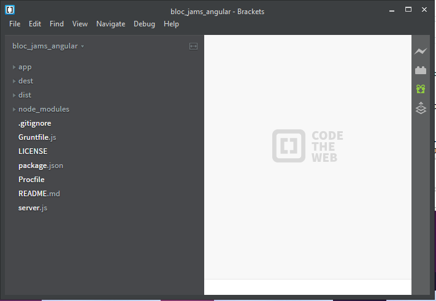

<h1>BlocJams</h1>

Welcome to Bloc Jams, a digital music player like Spotify a frontend web project. We started the backbone of the application layout with HTML, added styling and responsiveness using CSS, and implemented interactivity with JavaScript.

To make Bloc Jams more dynamic, we used vanilla JavaScript – no bells, no whistles, just JavaScript in its purest form. DOM scripting is "lightweight," as it requires no libraries that may slow page performance.

Experience with DOM scripting is essential, but frontend developers require knowledge of at least a few common libraries. jQuery is the most popular JavaScript library today. We used it to refactor the vanilla JavaScript we've implemented for the Bloc Jams landing page.

jQuery is a great tool for adding animations and effects to a page, but it's difficult to build a sophisticated frontend application with jQuery alone. In this project, again we have  refactored Bloc Jams using AngularJS, commonly referred to as Angular.

<h2>Use Case </h2>

For the use case, goto the link,  https://sharadalt.github.io/portfolio/blocjams
 
<h2>Configuration</h2>

    

 

<h2>How to run it </h2>

Run the application using the Gruntfile's default task:
$ grunt
The default task runs a simple server on port 3000. To view it in a any browser, go to http://localhost:3000.
Note that unless the application is run via Live Preview in Brackets, the browser will need to be refreshed to view the 
most recent changes.
